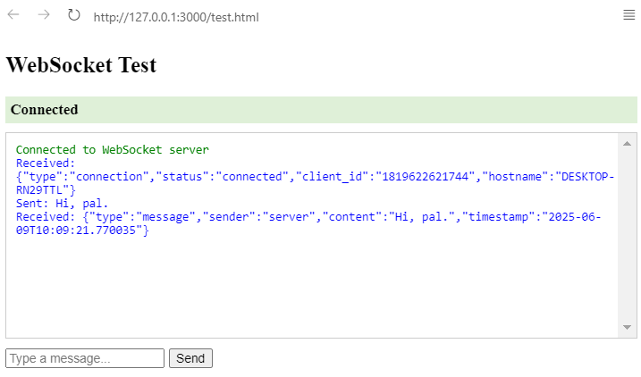
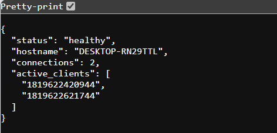
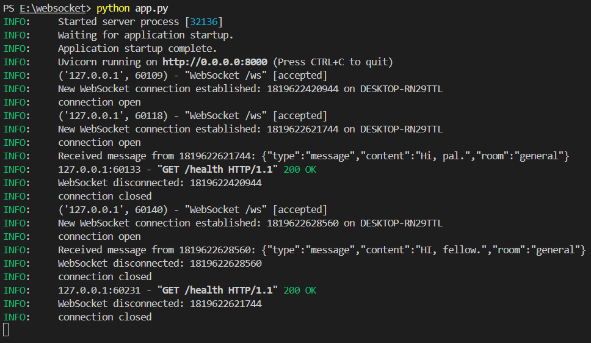

# WebSocket Server with ALB Setup

This project implements a WebSocket server using FastAPI and deploys it behind an AWS Application Load Balancer (ALB) with WebSocket support. It provides a scalable, production-ready WebSocket infrastructure with proper load balancing and health monitoring.

## What is HTTP?

Let’s start by looking at the basic implementation of a WebSocket server in a messaging app scenario. Imagine two clients messaging each other over an HTTP server. Each time a client sends a message, an HTTP request is sent, a server thread is generated, and the message is processed and returned to the other client. This process is repeated for every message, which is inefficient as the threads are created and terminated repeatedly.


## What is WebSocket?

WebSocket is a communication protocol that provides a full-duplex, persistent connection between a client and a server. Unlike traditional HTTP requests, WebSocket connections:

- Remain open after the initial handshake
- Allow bi-directional communication
- Enable real-time data exchange
- Maintain connection state
- Reduce overhead by eliminating repeated HTTP headers


In a WebSocket implementation, after the handshake between the client and the server is successful, the client is subscribed to the server.

For example, if two clients are subscribed to one WebSocket server, when client 1 sends a message to client 2, the server picks up the message and sends it to the subscribed client 2. This communication continues until the connection terminates.


## WebSocket vs HTTP

| Feature | WebSocket | HTTP |
|---------|-----------|------|
| Connection | Persistent | Stateless |
| Protocol | ws:// or wss:// | http:// or https:// |
| Headers | Once during handshake | Every request |
| Overhead | Low | High |
| State |  Stateful | Stateless |
| Use Case | Real-time applications | Traditional web requests |


## Table of Contents
- [Architecture Overview](#architecture-overview)
- [Prerequisites](#prerequisites)
- [Local Development](#local-development)
- [Testing](#testing)
- [Deployment](#deployment)
- [Infrastructure Components](#infrastructure-components)
- [Security](#security)
- [Monitoring](#monitoring)
- [Troubleshooting](#troubleshooting)
- [Cleanup](#cleanup)

## Project Overview
This project is divided into various chapters, each demonstrating different implementation approaches and deployment strategies:

- **Chapter 1**: WebSocket Connection and Sticky Sessions ([Learn more](DOC/Stickiness.md))
- **Chapter 2**: Shared Session Management ([Learn more](DOC/Shared-sessions.md))
- **Chapter 3**: Scaling WebSocket Applications ([Learn more](DOC/websocket-scaling.md))
- **Chapter 4**: Terraform Deployment for WebSocket Infrastructure ([Learn more](DOC/Deployment_terraform.md))

## Architecture Overview

The project follows a microservices architecture with the following components:


## 🚀 Getting Started

### Prerequisites

- Python 3.11 or higher installed
- Docker installed and running
- AWS CLI configured with appropriate credentials and permissions
- Terraform installed and initialized
- SSL certificate ARN for HTTPS (if HTTPS is required)
- Basic knowledge of AWS services (e.g., EC2, ALB, VPC)
- Git installed for version control
- A code editor or IDE (e.g., Visual Studio Code)

### Project Configuration

#### 1. Files Configuration
-  Create the `app.py` file:

```python
from fastapi import FastAPI, WebSocket, WebSocketDisconnect
from fastapi.middleware.cors import CORSMiddleware
import uvicorn
import json
import logging
import socket
from typing import Dict, Set
from datetime import datetime
from prometheus_fastapi_instrumentator import Instrumentator

logger = logging.getLogger("uvicorn")

app = FastAPI()

# Instrument FastAPI app for Prometheus metrics
Instrumentator().instrument(app).expose(app)

app.add_middleware(
    CORSMiddleware,
    allow_origins=["*"],
    allow_credentials=True,
    allow_methods=["*"],
    allow_headers=["*"],
)

class ConnectionManager:
    def __init__(self):
        self.active_connections: Dict[str, WebSocket] = {}
        self.rooms: Dict[str, Set[str]] = {
            "general": set(),
            "support": set(),
            "random": set()
        }
        self.user_rooms: Dict[str, str] = {}

    async def connect(self, websocket: WebSocket, client_id: str):
        self.active_connections[client_id] = websocket

    async def disconnect(self, client_id: str):
        if client_id in self.active_connections:
            del self.active_connections[client_id]
        if client_id in self.user_rooms:
            room = self.user_rooms[client_id]
            self.rooms[room].remove(client_id)
            del self.user_rooms[client_id]
            await self.broadcast_to_room(room, {
                "type": "user_left",
                "userId": client_id,
                "username": client_id
            })

    async def join_room(self, client_id: str, room: str):
        if client_id in self.user_rooms:
            old_room = self.user_rooms[client_id]
            self.rooms[old_room].remove(client_id)
        
        self.rooms[room].add(client_id)
        self.user_rooms[client_id] = room
        
        await self.broadcast_to_room(room, {
            "type": "user_joined",
            "userId": client_id,
            "username": client_id
        })
        
        return list(self.rooms[room])

    async def broadcast_to_room(self, room: str, message: dict):
        if room in self.rooms:
            for client_id in self.rooms[room]:
                if client_id in self.active_connections:
                    try:
                        await self.active_connections[client_id].send_json(message)
                    except Exception as e:
                        logger.error(f"Error broadcasting to {client_id}: {str(e)}")

manager = ConnectionManager()

@app.get("/")
async def root():
    hostname = socket.gethostname()
    return {"message": f"WebSocket server is running on {hostname}"}

@app.get("/health")
async def health_check():
    hostname = socket.gethostname()
    return {
        "status": "healthy",
        "hostname": hostname,
        "connections": len(manager.active_connections),
        "active_clients": list(manager.active_connections.keys())
    }

@app.websocket("/ws")
async def websocket_endpoint(websocket: WebSocket):
    try:
        await websocket.accept()
        client_id = str(id(websocket))
        await manager.connect(websocket, client_id)
        hostname = socket.gethostname()
        logger.info(f"New WebSocket connection established: {client_id} on {hostname}")
        
        # Send initial connection info
        await websocket.send_json({
            "type": "connection",
            "status": "connected",
            "client_id": client_id,
            "hostname": hostname
        })
        
        try:
            while True:
                data = await websocket.receive_text()
                logger.info(f"Received message from {client_id}: {data}")
                
                try:
                    # Try to parse as JSON first
                    message_data = json.loads(data)
                    
                    if message_data.get("type") == "join":
                        room = message_data.get("room", "general")
                        users = await manager.join_room(client_id, room)
                        await websocket.send_json({
                            "type": "room_users",
                            "users": list(users)
                        })
                    elif message_data.get("type") == "message":
                        room = manager.user_rooms.get(client_id, "general")
                        # Send echo response to sender
                        await websocket.send_json({
                            "type": "message",
                            "sender": "server",
                            "content": message_data.get("content", ""),
                            "timestamp": datetime.now().isoformat()
                        })
                        # Broadcast to room
                        await manager.broadcast_to_room(room, {
                            "type": "message",
                            "sender": client_id,
                            "content": message_data.get("content", ""),
                            "timestamp": datetime.now().isoformat()
                        })
                except json.JSONDecodeError:
                    # If not JSON, treat as plain text message
                    room = manager.user_rooms.get(client_id, "general")
                    # Send echo response to sender
                    await websocket.send_json({
                        "type": "message",
                        "sender": "server",
                        "content": data,
                        "timestamp": datetime.now().isoformat()
                    })
                    # Broadcast to room
                    await manager.broadcast_to_room(room, {
                        "type": "message",
                        "sender": client_id,
                        "content": data,
                        "timestamp": datetime.now().isoformat()
                    })
                
        except WebSocketDisconnect:
            logger.info(f"WebSocket disconnected: {client_id}")
            await manager.disconnect(client_id)
        except Exception as e:
            logger.error(f"Error in WebSocket connection {client_id}: {str(e)}")
            await websocket.close(code=1011, reason="Internal server error")
    except Exception as e:
        logger.error(f"Failed to establish WebSocket connection: {str(e)}")
        if websocket.client_state.CONNECTED:
            await websocket.close(code=1011, reason="Connection failed")

if __name__ == "__main__":
    uvicorn.run(app, host="0.0.0.0", port=8000) 
```

-  Create the `docker-compose.yml` file:
```yaml
# version: '3.8'

services:
  websocket-server:
    build: .
    ports:
      - "8000:8000"
    volumes:
      - .:/app
    environment:
      - ENVIRONMENT=development
    healthcheck:
      test: ["CMD", "curl", "-f", "http://localhost:8000/health"]
      interval: 30s
      timeout: 10s
      retries: 3

  prometheus:
    image: prom/prometheus:latest
    ports:
      - "9090:9090"
    volumes:
      - ./prometheus:/etc/prometheus
      - prometheus_data:/prometheus
    command:
      - '--config.file=/etc/prometheus/prometheus.yml'
      - '--storage.tsdb.path=/prometheus'
      - '--web.console.libraries=/usr/share/prometheus/console_libraries'
      - '--web.console.templates=/usr/share/prometheus/consoles'
      - '--web.enable-remote-write-receiver'
    restart: unless-stopped

  grafana:
    image: grafana/grafana:latest
    ports:
      - "3000:3000"
    volumes:
      - ./grafana/dashboards:/var/lib/grafana/dashboards
      - ./grafana/provisioning:/etc/grafana/provisioning
      - grafana_data:/var/lib/grafana
    environment:
      - GF_SECURITY_ADMIN_PASSWORD=admin
      - GF_USERS_ALLOW_SIGN_UP=false
    depends_on:
      - prometheus
    restart: unless-stopped

  k6:
    image: grafana/k6:latest
    ports:
      - "6565:6565"
    volumes:
      - ./k6:/scripts
    environment:
      - K6_PROMETHEUS_RW_SERVER_URL=http://prometheus:9090/api/v1/write
      - K6_PROMETHEUS_RW_TREND_AS_NATIVE_HISTOGRAM=false
    command: run --out experimental-prometheus-rw --tag testid=websocket-test /scripts/websocket-test.js

volumes:
  prometheus_data:
  grafana_data: 
```

- Create the `Dockerfile`:
```dockerfile
# create a Dockerfile to containerize the application:
FROM python:3.9-slim

WORKDIR /app

COPY requirements.txt .
RUN pip install --no-cache-dir -r requirements.txt

COPY . .

EXPOSE 8000

CMD ["uvicorn", "app:app", "--host", "0.0.0.0", "--port", "8000"] 
```

- Create the `requirements.txt` file:
```
fastapi==0.109.2
uvicorn==0.27.1
websockets==12.0
python-multipart==0.0.9
jinja2==3.1.3
python-dotenv==1.0.1
redis==5.0.1
prometheus-client
prometheus-fastapi-instrumentator==6.0.0
```

- Create the `test-client.html` file:
```html
<!DOCTYPE html>
<html lang="en">
<head>
    <meta charset="UTF-8">
    <meta name="viewport" content="width=device-width, initial-scale=1.0">
    <title>WebSocket Test Client</title>
    <style>
        body {
            font-family: Arial, sans-serif;
            max-width: 800px;
            margin: 0 auto;
            padding: 20px;
        }
        #messages {
            height: 300px;
            border: 1px solid #ccc;
            margin: 10px 0;
            padding: 10px;
            overflow-y: auto;
            background-color: #f9f9f9;
        }
        .message {
            margin: 5px 0;
            padding: 5px;
            border-radius: 3px;
        }
        .sent {
            background-color: #e3f2fd;
        }
        .received {
            background-color: #f1f8e9;
        }
        .error {
            background-color: #ffebee;
            color: #c62828;
        }
        .status {
            background-color: #fff3e0;
        }
        .controls {
            margin: 10px 0;
        }
        input[type="text"] {
            width: 70%;
            padding: 5px;
        }
        button {
            padding: 5px 15px;
            margin: 0 5px;
        }
        #connectionStatus {
            padding: 10px;
            margin: 10px 0;
            border-radius: 3px;
        }
        .connected {
            background-color: #e8f5e9;
            color: #2e7d32;
        }
        .disconnected {
            background-color: #ffebee;
            color: #c62828;
        }
        .connecting {
            background-color: #fff3e0;
            color: #ef6c00;
        }
    </style>
</head>
<body>
    <h1>WebSocket Test Client</h1>
    <div id="connectionStatus" class="disconnected">Disconnected</div>
    <div class="controls">
        <input type="text" id="messageInput" placeholder="Type a message...">
        <button onclick="sendMessage()">Send</button>
        <button onclick="connect()">Connect</button>
        <button onclick="disconnect()">Disconnect</button>
    </div>
    <div id="messages"></div>

    <script>
        let ws = null;
        let connectionTimeout = null;
        const MAX_RECONNECT_ATTEMPTS = 3;
        let reconnectAttempts = 0;

        function updateConnectionStatus(status, message) {
            const statusDiv = document.getElementById('connectionStatus');
            statusDiv.className = status.toLowerCase();
            statusDiv.textContent = message;
        }

        function addMessage(message, type) {
            const messagesDiv = document.getElementById('messages');
            const messageElement = document.createElement('div');
            messageElement.className = `message ${type}`;
            messageElement.textContent = `${new Date().toLocaleTimeString()} - ${message}`;
            messagesDiv.appendChild(messageElement);
            messagesDiv.scrollTop = messagesDiv.scrollHeight;
        }

        function connect() {
            if (ws && ws.readyState === WebSocket.OPEN) {
                addMessage('Already connected', 'status');
                return;
            }

            updateConnectionStatus('connecting', 'Connecting...');
            addMessage('Attempting to connect...', 'status');

            // Clear any existing connection timeout
            if (connectionTimeout) {
                clearTimeout(connectionTimeout);
            }

            // Set connection timeout
            connectionTimeout = setTimeout(() => {
                if (ws && ws.readyState !== WebSocket.OPEN) {
                    addMessage('Connection timeout', 'error');
                    updateConnectionStatus('disconnected', 'Connection timeout');
                    ws.close();
                }
            }, 10000);

            try {
                ws = new WebSocket('ws://localhost:8000/ws');

                ws.onopen = function() {
                    clearTimeout(connectionTimeout);
                    updateConnectionStatus('connected', 'Connected');
                    addMessage('Connection established', 'status');
                    reconnectAttempts = 0;
                };

                ws.onmessage = function(event) {
                    try {
                        const data = JSON.parse(event.data);
                        addMessage(`Received: ${JSON.stringify(data, null, 2)}`, 'received');
                    } catch (e) {
                        addMessage(`Received: ${event.data}`, 'received');
                    }
                };

                ws.onerror = function(error) {
                    addMessage(`WebSocket Error: ${error.type}`, 'error');
                    console.error('WebSocket Error:', error);
                };

                ws.onclose = function(event) {
                    clearTimeout(connectionTimeout);
                    updateConnectionStatus('disconnected', `Disconnected (Code: ${event.code}, Reason: ${event.reason || 'No reason provided'})`);
                    addMessage(`Connection closed. Code: ${event.code}, Reason: ${event.reason || 'No reason provided'}`, 'error');

                    // Attempt to reconnect if not manually disconnected
                    if (event.code !== 1000 && reconnectAttempts < MAX_RECONNECT_ATTEMPTS) {
                        reconnectAttempts++;
                        addMessage(`Attempting to reconnect (${reconnectAttempts}/${MAX_RECONNECT_ATTEMPTS})...`, 'status');
                        setTimeout(connect, 2000);
                    }
                };
            } catch (error) {
                addMessage(`Connection Error: ${error.message}`, 'error');
                updateConnectionStatus('disconnected', 'Connection failed');
                console.error('Connection Error:', error);
            }
        }

        function disconnect() {
            if (ws) {
                ws.close(1000, 'Client disconnected');
                ws = null;
            }
        }

        function sendMessage() {
            const messageInput = document.getElementById('messageInput');
            const message = messageInput.value.trim();
            
            if (!message) return;

            if (!ws || ws.readyState !== WebSocket.OPEN) {
                addMessage('Not connected to server', 'error');
                return;
            }

            try {
                ws.send(message);
                addMessage(`Sent: ${message}`, 'sent');
                messageInput.value = '';
            } catch (error) {
                addMessage(`Error sending message: ${error.message}`, 'error');
                console.error('Send Error:', error);
            }
        }

        // Handle Enter key in message input
        document.getElementById('messageInput').addEventListener('keypress', function(e) {
            if (e.key === 'Enter') {
                sendMessage();
            }
        });
    </script>
</body>
</html> 
```


2. Install dependencies:
```bash
pip install -r requirements.txt
```

3. Run the server locally:
```bash
python app.py
```
You should see output like:
```
INFO:     Will watch for changes in these directories: ['E:\\websocket']
INFO:     Uvicorn running on http://localhost:8000 (Press CTRL+C to quit)
INFO:     Started reloader process [...]
INFO:     Application startup complete.
```

### Step 3: Test WebSocket Connection
1. In `test.html`, update the path (if need):
``` 
ws = new WebSocket('ws://localhost:8000/ws');
```
2. Open the `test.html` file in your web browser
3. You should see:
   - A message box
   - A "Connected to WebSocket server" message
   - An input field to type messages

### Step 4: Test Message Exchange
1. Type a message in the input field
2. Click "Send" or press Enter
3. You should see:
   - "Sent: [your message]" in the message box
   - "Received: [your message]" as an echo response


### Step 5: Test Multiple Connections
1. Open `test.html` in multiple browser windows
2. Each window should:
   - Connect successfully
   - Show its own connection status
   - Be able to send/receive messages independently


### Step 6: Test the Health Endpoint
1. Open your web browser
2. Go to: `http://localhost:8000/health`
3. You should see a JSON response like:
```json
{
    "status": "healthy",
    "connections": 0
}
```


### Step 7: Test Error Handling

1. Stop the WebSocket server by pressing `Ctrl+C` in the terminal.
2. Observe the `test.html` browser window:
   - It should display a message like "Disconnected from WebSocket server."
3. Restart the WebSocket server using the command:
   ```bash
   python app.py
   ```
4. Verify that the connection in `test.html` automatically reconnects and resumes functionality.


<!-- ### Step 8: Monitor Server Logs

During testing, observe the server console for the following events:
- **Connection Events**: Logs indicating when a client connects to the WebSocket server.
- **Message Receipts**: Logs showing messages received from clients.
- **Disconnection Events**: Logs indicating when a client disconnects from the server.
- **Error Logs**: Any errors encountered during operation, such as connection issues or unexpected exceptions. -->
## Load Testing

### Step 1: Start the Stack
Open docker desktop. Run the following command to build and start the stack:
```bash
docker-compose up -d --build
```

### Step 2: Access the WebSocket Server
- Open [http://localhost:8000](http://localhost:8000) in your browser.
- Use the `test-client.html` file to test the WebSocket connection.

### Step 3: Access Grafana
- Open [http://localhost:3000](http://localhost:3000).
- Log in with:
   - **Username**: `admin`
   - **Password**: `admin`
- Add Prometheus as a data source:
   1. Navigate to **Configuration > Data Sources**.
   2. Click **Add data source**.
   3. Select **Prometheus**.
   4. Set the URL to `http://prometheus:9090`.
   5. Click **Save & Test**.
- Import the dashboard:
   1. Go to **Dashboards > Import**.
   2. Click **Upload JSON file**.
   3. Select the `grafana-dashboard.json` file.
   4. Click **Import**.

### Step 4: Run Load Tests
- Install k6 from [k6 Installation Guide](https://grafana.com/docs/k6/latest/set-up/install-k6/). For Windows, use the MSI installer.
- Run the load test:
```bash
& 'C:\Program Files\k6\k6.exe' run load-test.js
```

### Step 5: Monitor the Results
- Open the Grafana dashboard to monitor:
   - Active WebSocket connections.
   - Message latency.
   - Message throughput.
- The dashboard updates automatically every 5 seconds.

### Load Test Configuration
The load test will:
- Ramp up to **50 users** in **30 seconds**.
- Stay at **50 users** for **1 minute**.
- Ramp up to **100 users** in **30 seconds**.
- Stay at **100 users** for **1 minute**.
- Ramp down to **0 users** in **30 seconds**.

### Step 6: Scale the Application
To scale the application, run multiple instances:
```bash
docker-compose up -d --scale app=3
```
- All instances will share the same Redis instance for message broadcasting.
- Prometheus will collect metrics from all instances.

### Features of the Setup
- **Redis**: Used for message broadcasting across instances.
- **Session Persistence**: Managed in Redis.
- **Prometheus**: Collects metrics from all instances.
- **Grafana**: Provides visualization of metrics.
- **k6**: Performs load testing.


## Troubleshooting

Common issues and solutions:

1. **Connection Issues**
   - Check security groups
   - Verify ALB configuration
   - Check instance health

2. **Performance Issues**
   - Monitor instance metrics
   - Check ALB metrics
   - Verify auto-scaling

3. **Deployment Issues**
   - Check Terraform state
   - Verify IAM permissions
   - Check container logs


## Additional Resources

- [FastAPI Documentation](https://fastapi.tiangolo.com/)
- [AWS ALB Documentation](https://docs.aws.amazon.com/elasticloadbalancing/latest/application/introduction.html)
- [WebSocket Protocol](https://tools.ietf.org/html/rfc6455)

## Contributing

1. Fork the repository
2. Create a feature branch
3. Commit your changes
4. Push to the branch
5. Create a Pull Request
-----------------------------

