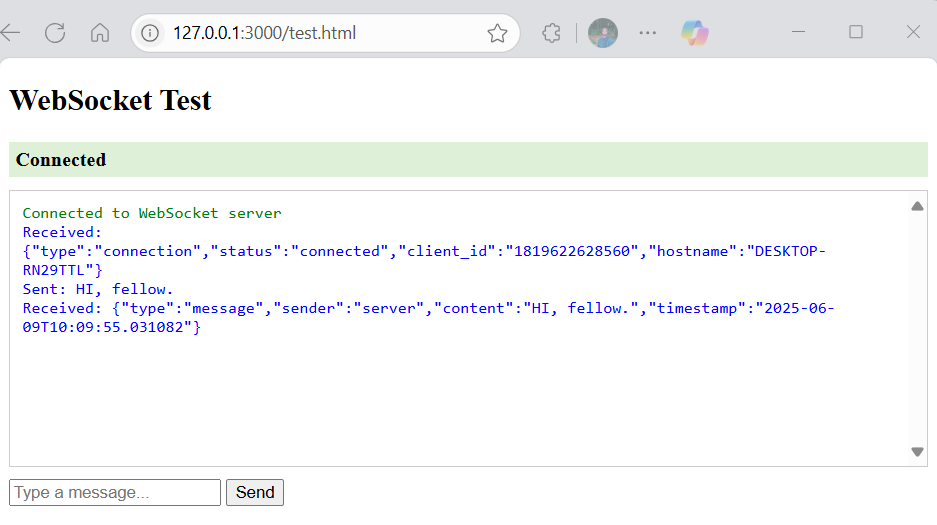

# WebSocket Server with ALB Setup

This project implements a WebSocket server using FastAPI and deploys it behind an AWS Application Load Balancer (ALB) with WebSocket support. It provides a scalable, production-ready WebSocket infrastructure with proper load balancing and health monitoring.

## What is HTTP?

Let’s start by looking at the basic implementation of a WebSocket server in a messaging app scenario. Imagine two clients messaging each other over an HTTP server. Each time a client sends a message, an HTTP request is sent, a server thread is generated, and the message is processed and returned to the other client. This process is repeated for every message, which is inefficient as the threads are created and terminated repeatedly.


## What is WebSocket?

WebSocket is a communication protocol that provides a full-duplex, persistent connection between a client and a server. Unlike traditional HTTP requests, WebSocket connections:

- Remain open after the initial handshake
- Allow bi-directional communication
- Enable real-time data exchange
- Maintain connection state
- Reduce overhead by eliminating repeated HTTP headers


In a WebSocket implementation, after the handshake between the client and the server is successful, the client is subscribed to the server.

For example, if two clients are subscribed to one WebSocket server, when client 1 sends a message to client 2, the server picks up the message and sends it to the subscribed client 2. This communication continues until the connection terminates.


## WebSocket vs HTTP

| Feature | WebSocket | HTTP |
|---------|-----------|------|
| Connection | Persistent | Stateless |
| Protocol | ws:// or wss:// | http:// or https:// |
| Headers | Once during handshake | Every request |
| Overhead | Low | High |
| State |  Stateful | Stateless |
| Use Case | Real-time applications | Traditional web requests |


## Table of Contents
- [Architecture Overview](#architecture-overview)
- [Prerequisites](#prerequisites)
- [Local Development](#local-development)
- [Testing](#testing)
- [Deployment](#deployment)
- [Infrastructure Components](#infrastructure-components)
- [Security](#security)
- [Monitoring](#monitoring)
- [Troubleshooting](#troubleshooting)
- [Cleanup](#cleanup)

## Project Overview
This project is divided into various chapters, each demonstrating different implementation approaches and deployment strategies:

- **Chapter 1**: WebSocket Connection and Sticky Sessions ([Learn more](DOC/Stickiness.md))
- **Chapter 2**: Shared Session Management ([Learn more](DOC/Shared-sessions.md))
- **Chapter 3**: Scaling WebSocket Applications ([Learn more](DOC/websocket-scaling.md))
- **Chapter 4**: Terraform Deployment for WebSocket Infrastructure ([Learn more](DOC/Deployment_terraform.md))

## Architecture Overview

The project follows a microservices architecture with the following components:


## 🚀 Getting Started

### Prerequisites

- Python 3.11 or higher installed
- Docker installed and running
- AWS CLI configured with appropriate credentials and permissions
- Terraform installed and initialized
- SSL certificate ARN for HTTPS (if HTTPS is required)
- Basic knowledge of AWS services (e.g., EC2, ALB, VPC)
- Git installed for version control
- A code editor or IDE (e.g., Visual Studio Code)

### Installation

1. Clone the repository:
```bash
git clone https://github.com/SM-Shaan/websocket-scaling.git
cd websocket
```

2. Install dependencies:
```bash
pip install -r requirements.txt
```

3. Run the server locally:
```bash
python app.py
```
You should see output like:
```
INFO:     Will watch for changes in these directories: ['E:\\websocket']
INFO:     Uvicorn running on http://localhost:8000 (Press CTRL+C to quit)
INFO:     Started reloader process [...]
INFO:     Application startup complete.
```

### Step 3: Test WebSocket Connection
1. In `test.html`, update the path (if need):
``` 
ws = new WebSocket('ws://localhost:8000/ws');
```
2. Open the `test.html` file in your web browser
3. You should see:
   - A message box
   - A "Connected to WebSocket server" message
   - An input field to type messages

### Step 4: Test Message Exchange
1. Type a message in the input field
2. Click "Send" or press Enter
3. You should see:
   - "Sent: [your message]" in the message box
   - "Received: [your message]" as an echo response


### Step 5: Test Multiple Connections
1. Open `test.html` in multiple browser windows
2. Each window should:
   - Connect successfully
   - Show its own connection status
   - Be able to send/receive messages independently



### Step 6: Test the Health Endpoint
1. Open your web browser
2. Go to: `http://localhost:8000/health`
3. You should see a JSON response like:
```json
{
    "status": "healthy",
    "connections": 0
}
```


### Step 7: Test Error Handling

1. Stop the WebSocket server by pressing `Ctrl+C` in the terminal.
2. Observe the `test.html` browser window:
   - It should display a message like "Disconnected from WebSocket server."
3. Restart the WebSocket server using the command:
   ```bash
   python app.py
   ```
4. Verify that the connection in `test.html` automatically reconnects and resumes functionality.


<!-- ### Step 8: Monitor Server Logs

During testing, observe the server console for the following events:
- **Connection Events**: Logs indicating when a client connects to the WebSocket server.
- **Message Receipts**: Logs showing messages received from clients.
- **Disconnection Events**: Logs indicating when a client disconnects from the server.
- **Error Logs**: Any errors encountered during operation, such as connection issues or unexpected exceptions. -->
## Load Testing

### Step 1: Start the Stack
Open docker desktop. Run the following command to build and start the stack:
```bash
docker-compose up -d --build
```

### Step 2: Access the WebSocket Server
- Open [http://localhost:8000](http://localhost:8000) in your browser.
- Use the `test-client.html` file to test the WebSocket connection.

### Step 3: Access Grafana
- Open [http://localhost:3000](http://localhost:3000).
- Log in with:
   - **Username**: `admin`
   - **Password**: `admin`
- Add Prometheus as a data source:
   1. Navigate to **Configuration > Data Sources**.
   2. Click **Add data source**.
   3. Select **Prometheus**.
   4. Set the URL to `http://prometheus:9090`.
   5. Click **Save & Test**.
- Import the dashboard:
   1. Go to **Dashboards > Import**.
   2. Click **Upload JSON file**.
   3. Select the `grafana-dashboard.json` file.
   4. Click **Import**.

### Step 4: Run Load Tests
- Install k6 from [k6 Installation Guide](https://grafana.com/docs/k6/latest/set-up/install-k6/). For Windows, use the MSI installer.
- Run the load test:
```bash
& 'C:\Program Files\k6\k6.exe' run load-test.js
```

### Step 5: Monitor the Results
- Open the Grafana dashboard to monitor:
   - Active WebSocket connections.
   - Message latency.
   - Message throughput.
- The dashboard updates automatically every 5 seconds.

### Load Test Configuration
The load test will:
- Ramp up to **50 users** in **30 seconds**.
- Stay at **50 users** for **1 minute**.
- Ramp up to **100 users** in **30 seconds**.
- Stay at **100 users** for **1 minute**.
- Ramp down to **0 users** in **30 seconds**.

### Step 6: Scale the Application
To scale the application, run multiple instances:
```bash
docker-compose up -d --scale app=3
```
- All instances will share the same Redis instance for message broadcasting.
- Prometheus will collect metrics from all instances.

### Features of the Setup
- **Redis**: Used for message broadcasting across instances.
- **Session Persistence**: Managed in Redis.
- **Prometheus**: Collects metrics from all instances.
- **Grafana**: Provides visualization of metrics.
- **k6**: Performs load testing.


## Troubleshooting

Common issues and solutions:

1. **Connection Issues**
   - Check security groups
   - Verify ALB configuration
   - Check instance health

2. **Performance Issues**
   - Monitor instance metrics
   - Check ALB metrics
   - Verify auto-scaling

3. **Deployment Issues**
   - Check Terraform state
   - Verify IAM permissions
   - Check container logs


## Additional Resources

- [FastAPI Documentation](https://fastapi.tiangolo.com/)
- [AWS ALB Documentation](https://docs.aws.amazon.com/elasticloadbalancing/latest/application/introduction.html)
- [WebSocket Protocol](https://tools.ietf.org/html/rfc6455)

## Contributing

1. Fork the repository
2. Create a feature branch
3. Commit your changes
4. Push to the branch
5. Create a Pull Request
-----------------------------

