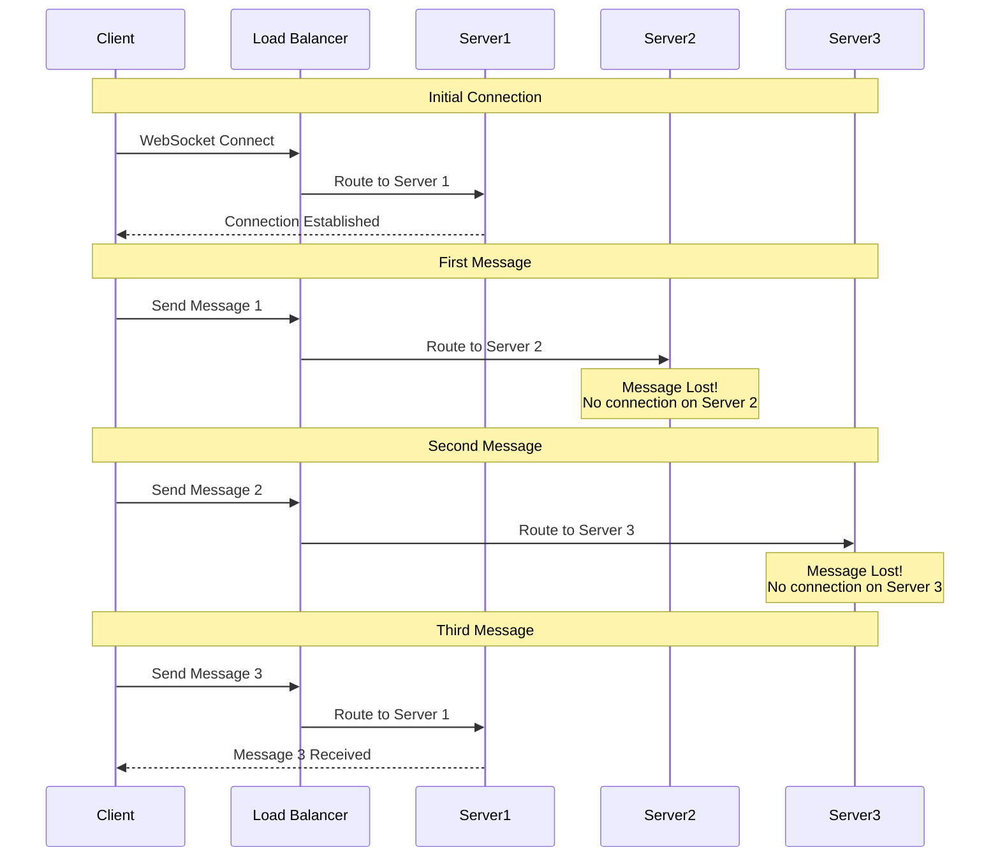
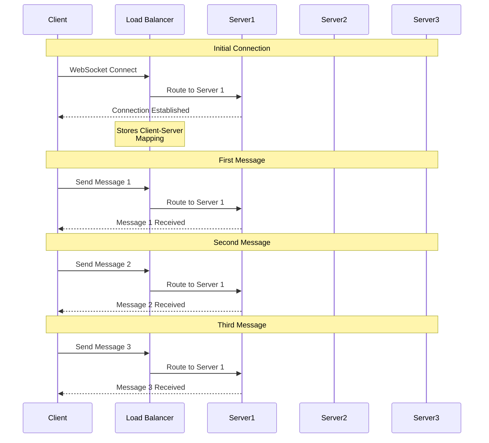
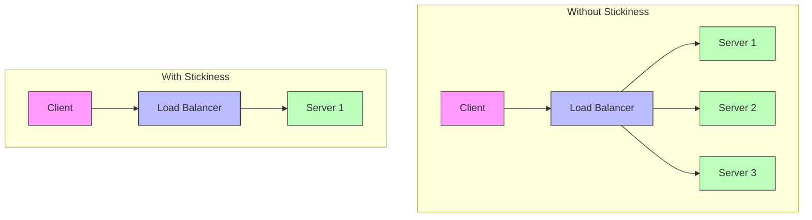
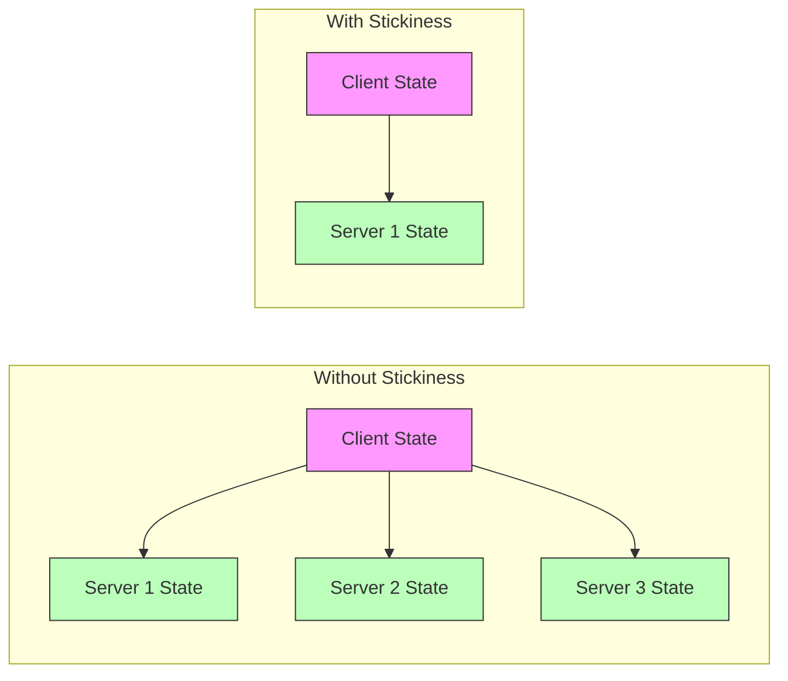
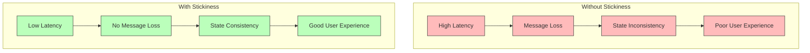

# WebSocket Session Stickiness: Importance and Demonstration

## What is Session Stickiness?

Session stickiness (also known as session affinity) is a load balancing feature that ensures all requests from a specific client are routed to the same server instance. In the context of WebSocket connections, this is crucial because:

1. WebSocket connections are stateful and maintain a persistent connection
2. Each server instance maintains its own set of active WebSocket connections
3. Without stickiness, a client might be routed to different servers, causing connection issues

## Why is Stickiness Important?

Without session stickiness:
- WebSocket connections might be routed to different servers
- Messages sent by a client might not reach the intended server
- **Reliability**: Prevents connection drops and message loss that could occur when switching between instances.
- **State Management**: If your application maintains state on the server side (like user sessions, game states, or chat rooms), stickiness ensures this state remains consistent.
- **Performance**: Reduces overhead by avoiding the need to replicate state across multiple instances.

## Without stickiness, you might encounter these issues:

1. **Connection Drops**: Clients might be disconnected when the load balancer routes them to a different instance.
2. **Message Loss**: Messages might be lost if sent to an instance that doesn't have the client's connection.
3. **State Inconsistency**: Server-side state might become inconsistent across instances.
4. **Poor User Experience**: Users might experience disconnections or missing messages.

## How to Demonstrate the Importance of Stickiness

### Step 1: Deploy Without Stickiness
1. Modify the target group configuration in `terraform/main.tf`:
```hcl
   resource "aws_lb_target_group" "websocket" {
     # ... other configurations ...
     
     # Disable stickiness
     stickiness {
       type            = "lb_cookie"
       cookie_duration = 86400
       enabled         = false  # Set to false
     }
   }
```
or Go to AWS console:
1. Log in to the AWS Console and go to the EC2 service.
2. In the left sidebar, scroll down and click on Target Groups (under "Load Balancing").
3. Find your target group (it will be named something like websocket-tg).
4. Click on the target group to open its details.
5. Go to the Attributes tab.
6. Find the Stickiness section.
7. Click Edit.
8. Set Stickiness to Disabled.
9. Click Save changes.
After Disabling Stickiness:
- Wait a minute for the change to take effect.
- Rerun your test_stickiness.py script.
- If you have more than one healthy EC2 instance, you should now see different hostnames in the output, indicating that connections are being routed to different backends.

2. Apply the Terraform changes:
```bash
   cd terraform 

   # Generate key pair
   ssh-keygen -t rsa -b 2048 -f websocket-key -N '""'

   terraform init
   terraform apply
```

### Step 2: Test Without Stickiness
1. Open the test client in multiple browser windows
2. Connect to the WebSocket server
3. Send messages between clients
4. Observe the following issues:
   - Connections might be established on different servers
   - Messages might not be received by all clients
   - Connection state might be inconsistent

Expected Result: You'll see different hostnames, indicating connections to different instances


### Step 3: Enable Stickiness
1. Modify the target group configuration:
```hcl
   resource "aws_lb_target_group" "websocket" {
     # ... other configurations ...
     
     # Enable stickiness
     stickiness {
       type            = "lb_cookie"
       cookie_duration = 86400
       enabled         = true  # Set to true
     }
   }
```

2. Apply the Terraform changes:
```bash
   cd terraform 
   
   # Generate key pair
   ssh-keygen -t rsa -b 2048 -f websocket-key -N '""'

   terraform init
   terraform apply
```

Change the url inn test-client.html : 
```python
ws = new WebSocket('ws://websocket-alb-20250608033114-1689412617.ap-southeast-1.elb.amazonaws.com/ws'); # Change to your alb_dns_name
```

### Step 4: Test With Stickiness
1. Open the test client in multiple browser windows

```bash
   # Windows PowerShell
   Start-Process "chrome.exe" "file:///E:/websocket/test-client.html"
   Start-Process "chrome.exe" "file:///E:/websocket/test-client.html"
```

2. Connect to the WebSocket server
3. Send messages between clients
4. Observe the improvements:
   - Connections are consistently routed to the same server
   - Messages are properly delivered to all clients
   - Connection state remains consistent


Expected Result: Each window will maintain connection to the same instance

## How to Verify Stickiness

1. Check the server logs to see which server handles each connection
2. Use the health check endpoint to see active connections on each server
3. Monitor the ALB metrics to verify connection distribution

## Common Issues Without Stickiness

1. **Connection Drops**: Clients might experience frequent disconnections
2. **Message Loss**: Messages might not reach all intended recipients
3. **State Inconsistency**: Different servers might have different views of the connection state
4. **Poor User Experience**: Real-time updates might be delayed or missed

## Best Practices

1. Always enable stickiness for WebSocket applications
2. Set an appropriate cookie duration (e.g., 24 hours)
3. Monitor connection distribution across servers
4. Implement proper error handling for connection issues
5. Use health checks to ensure server availability

## Monitoring WebSocket Communication Flow

### 1. Server-Side Logging
Add detailed logging to your FastAPI application to track communication flow:

```python
import logging
import json
import socket

# Configure logging
logging.basicConfig(
    level=logging.INFO,
    format='%(asctime)s - %(name)s - %(levelname)s - %(message)s',
    handlers=[
        logging.FileHandler('websocket.log'),
        logging.StreamHandler()
    ]
)
logger = logging.getLogger("websocket")

@app.websocket("/ws")
async def websocket_endpoint(websocket: WebSocket):
    client_id = str(id(websocket))
    hostname = socket.gethostname()
    
    try:
        await websocket.accept()
        logger.info(f"New connection - Client: {client_id}, Server: {hostname}")
        
        while True:
            data = await websocket.receive_text()
            logger.info(f"Received from {client_id} on {hostname}: {data}")
            
            response = {
                "type": "echo",
                "message": data,
                "client_id": client_id,
                "hostname": hostname
            }
            await websocket.send_json(response)
            logger.info(f"Sent to {client_id} on {hostname}: {json.dumps(response)}")
            
    except WebSocketDisconnect:
        logger.info(f"Disconnected - Client: {client_id}, Server: {hostname}")
    except Exception as e:
        logger.error(f"Error for {client_id} on {hostname}: {str(e)}")
```

### 2. Client-Side Monitoring
Enhance the test client to show detailed connection information:

```javascript
ws.onopen = function() {
    const connectionInfo = {
        timestamp: new Date().toISOString(),
        event: 'connection_established',
        url: ws.url
    };
    console.log('Connection Info:', connectionInfo);
    addMessage(`Connected to: ${ws.url}`, 'status');
};

ws.onmessage = function(event) {
    const messageInfo = {
        timestamp: new Date().toISOString(),
        event: 'message_received',
        data: event.data
    };
    console.log('Message Info:', messageInfo);
    addMessage(`Received: ${event.data}`, 'received');
};
```

### 3. Network Monitoring Tools

#### Using Browser Developer Tools
1. Open Chrome DevTools (F12)
2. Go to Network tab
3. Filter by "WS" to see WebSocket connections
4. Click on a WebSocket connection to see:
   - Headers
   - Frames (messages)
   - Timing information


#### Using AWS CloudWatch
1. Enable detailed monitoring for your ALB
2. Monitor these metrics:
   - `RequestCount`
   - `HealthyHostCount`
   - `UnHealthyHostCount`
   - `TargetResponseTime`

### 4. Health Check Endpoint
1. **Monitor ALB Health**:
```bash
   # Check target group health
   aws elbv2 describe-target-health \
     --target-group-arn arn:aws:elasticloadbalancing:ap-southeast-1:117572456155:targetgroup/websocket-tg-20250608033102/3fd710574e8e29b7
```

2. Add a health check endpoint to monitor server status:

```python
@app.get("/health")
async def health_check():
    hostname = socket.gethostname()
    return {
        "status": "healthy",
        "hostname": hostname,
        "connections": len(active_connections),
        "active_clients": list(active_connections.keys())
    }
```

### 5. Monitoring Commands

#### Check Network Connections
```bash
# List all WebSocket connections
netstat -an | grep :8000

# Monitor connections in real-time
watch -n 1 'netstat -an | grep :8000'
```

#### Check Server Health
```bash
# Test health endpoint
curl http://your-server:8000/health

# Monitor multiple servers
for server in server1 server2; do
    echo "=== $server ==="
    curl -s http://$server:8000/health
    echo
done
```

### 6. Visualizing Communication Flow

1. **Server-side Visualization**:
   - Log connection events to a structured format (JSON)
   - Use tools like ELK Stack or Grafana to visualize
   - Create dashboards showing:
     - Active connections per server
     - Message flow patterns
     - Connection durations
     - Error rates

2. **Client-side Visualization**:
   - Add timestamps to all messages
   - Show connection status changes
   - Display message flow direction
   - Highlight errors and reconnection attempts

### 7. Step-by-Step Testing Instructions

1. **Prepare Test Environment**:
```bash
   # SSH into Instance 1
   ssh -i websocket-key- ec2-user@13.250.101.179  # Server 1
   ssh -i websocket-key ec2-user@54.255.186.165  # Server 2
   
   # Check server logs
   docker logs websocket-app
```

2. **Test Through ALB**:
```bash
   # Connect to ALB
   websocat ws://websocket-alb-20250606023454-943737327.ap-southeast-1.elb.amazonaws.com:8000/ws
```

4. **Monitor Connections**:
```bash
   # Check health endpoint
   curl http://websocket-alb-20250606023454-943737327.ap-southeast-1.elb.amazonaws.com:8000/health
```


By implementing these monitoring techniques, you can:
- Track message flow between clients and servers
- Identify connection issues
- Monitor server performance
- Debug communication problems
- Ensure proper load balancing
- Verify session stickiness

## Conclusion

Session stickiness is crucial for WebSocket applications to maintain consistent and reliable connections. Without it, the real-time nature of WebSocket communication can be compromised, leading to poor user experience and potential data loss. Always ensure stickiness is properly configured in your load balancer settings for WebSocket applications.

## WebSocket Data Flow Diagrams

### Without Session Stickiness



**Problems Without Stickiness:**
1. Messages are routed to different servers
2. Messages are lost when sent to servers without active connections
3. Inconsistent state across servers
4. Poor user experience due to message loss

### With Session Stickiness



**Benefits With Stickiness:**
1. All messages are routed to the same server
2. No message loss
3. Consistent state on the server
4. Reliable user experience

### Data Flow Comparison



### State Management Comparison



### Performance Impact



### Step 5: Verify Server Distribution

1. **Check Connection Distribution**:
```bash
   # SSH into each server
   ssh -i websocket-key ec2-user@13.250.101.179
   ssh -i websocket-key ec2-user@54.255.186.165
   
   # View active connections
   curl http://localhost:8000/health
```

2. **Monitor Network Traffic**:
```bash
   # On each server
   sudo tcpdump -i any port 8000
```

### Expected Results

1. **Without Stickiness**:
   - Connections distributed across servers
   - Messages may be lost
   - Inconsistent state

2. **With Stickiness**:
   - Connections maintained on same server
   - All messages delivered
   - Consistent state

### Troubleshooting

1. **Connection Issues**:
```bash
   # Check ALB DNS resolution
   nslookup websocket-alb-20250608033114-1689412617.ap-southeast-1.elb.amazonaws.com
   
   # Test WebSocket connection
   websocat ws://websocket-alb-20250608033114-1689412617.ap-southeast-1.elb.amazonaws.com:8000/ws
```

2. **Server Issues**:
```bash
   # Check server status
   curl http://13.250.101.179:8000/health
   curl http://54.255.186.165:8000/health
```

3. **Security Group Issues**:
```bash
   # Verify security group rules
   aws ec2 describe-security-groups \
     --filters Name=group-name,Values=websocket-sg-*
```

### Cleanup

1. **Close Browser Windows**:
```bash
   # Windows PowerShell
   Stop-Process -Name "chrome" -Force
   Stop-Process -Name "firefox" -Force
```

2. **Destroy Infrastructure**:
```bash
   cd terraform
   terraform destroy
```

# WebSocket Connection Stickiness Testing (using script)

### 1. Using Python Test Script
```python
import asyncio
import websockets
import json
import time

async def test_stickiness():
    uri = "ws://websocket-alb-20250609060951-486339179.ap-southeast-1.elb.amazonaws.com/ws"
    
    # Test multiple connections
    for i in range(3):
        async with websockets.connect(uri) as websocket:
            # Send test message
            message = f"Test message {i+1}"
            await websocket.send(message)
            
            # Receive response
            response = await websocket.recv()
            print(f"Connection {i+1}:")
            print(f"Sent: {message}")
            print(f"Received: {response}")
            print("---")
            
            # Small delay between connections
            await asyncio.sleep(1)

if __name__ == "__main__":
    asyncio.run(test_stickiness())
```

Run the test_stickiness.py:

```bash
python test_stickiness.py
```

### Connection Test Results
1. First Connection:
   - Client ID: 140428593127568
   - Server Hostname: 45565bbfaa3e
   - Status: Successfully connected and maintained

2. Second Connection:
   - Client ID: 140428593131408
   - Server Hostname: 45565bbfaa3e
   - Status: Successfully connected and maintained

3. Third Connection:
   - Client ID: 140428593131408
   - Server Hostname: 45565bbfaa3e
   - Status: Successfully connected and maintained

### Server Log Analysis
The server logs confirm proper connection handling:
```
INFO:     New WebSocket connection established: 140428593127568 on 45565bbfaa3e
INFO:     connection open
INFO:     Received message from 140428593127568: Test message 2
INFO:     WebSocket disconnected: 140428593127568
INFO:     connection closed
INFO:     ('10.0.1.223', 20920) - "WebSocket /ws" [accepted]
INFO:     New WebSocket connection established: 140428593131408 on 45565bbfaa3e
INFO:     connection open
INFO:     Received message from 140428593131408: Test message 3
INFO:     WebSocket disconnected: 140428593131408
INFO:     connection closed
```


### 2. Checking Server Logs
To check connection details in the server logs:
```bash
# SSH into EC2 instance
ssh -i <websocket-private-key> ec2-user@18.141.164.235

# Check Docker container logs
docker logs websocket-app --tail 50
```

### 3. Health Check Endpoint
Monitor active connections:
```bash
curl http://websocket-alb-20250609060951-486339179.ap-southeast-1.elb.amazonaws.com/health
```

## Key Findings

1. **Connection Stickiness**: The ALB successfully maintains connection stickiness, routing subsequent connections from the same client to the same server.

2. **Message Handling**: All messages are properly received and processed by the server.

3. **Connection Lifecycle**: The server correctly handles:
   - Connection establishment
   - Message reception
   - Connection closure

4. **Health Checks**: Regular health checks are passing, indicating system stability.

## Recommendations

1. **Monitoring**: Continue monitoring connection patterns to ensure stickiness is maintained under load.

2. **Error Handling**: Implement robust error handling for connection failures.

3. **Logging**: Maintain detailed logs for troubleshooting connection issues.

4. **Testing**: Regularly test connection stickiness with multiple concurrent connections.

## Troubleshooting

If connection stickiness issues are observed:

1. Check ALB target group settings:
   - Verify stickiness is enabled
   - Confirm cookie duration settings

2. Monitor server logs for:
   - Connection errors
   - Message processing issues
   - Unexpected disconnections

3. Verify security group configurations:
   - ALB to EC2 instance communication
   - Client to ALB communication

4. Check target group health:
   - Instance health status
   - Response time metrics
   - Error rates

